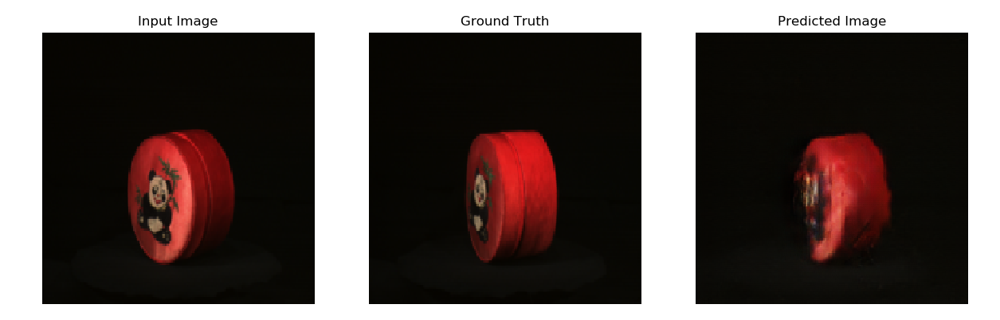

# Generating multiple views of objects from a Single image using Pix2Pix

The aim of this experiment is to see how well the famous Pix2Pix model performs on the task of generting multiple views of an object by taking as input only a single image/view.

Link to multi-view dataset: http://aloi.science.uva.nl/tars/aloi_red4_view.tar

The file prepare-data.py converts the images in the mentioned dataset into a form required by [TensorFlow's implementation](https://www.tensorflow.org/tutorials/generative/pix2pix) of Pix2Pix, the file pix2pix.py is a slightly modified version of same.
The code can be run readily if the sub-directory "png4" (from the link above) is in the same directly.
Initial results are encouraging after about 50 epochs and can be improved.

## Experimental results

